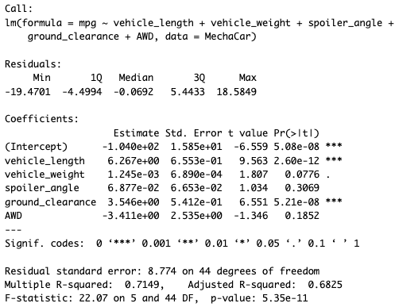
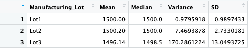
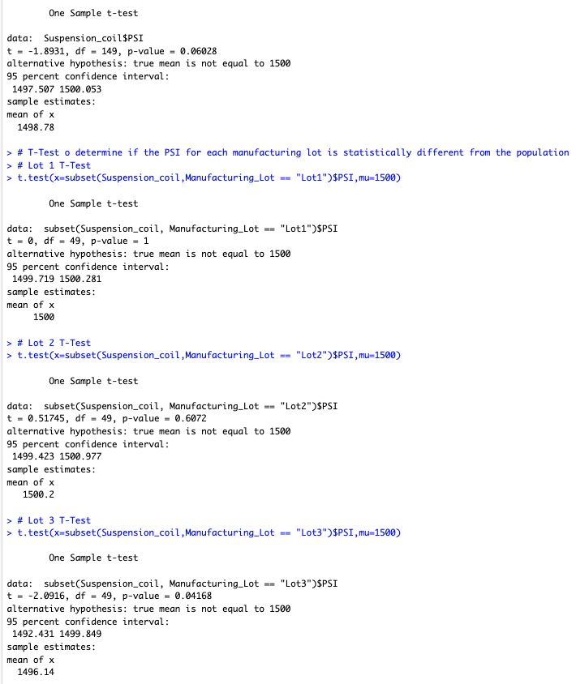

# MechaCar_Statistical_Analysis

## Background

AutosRUs’ newest prototype, the MechaCar, is suffering from production troubles that are blocking the manufacturing team’s progress. AutosRUs’ upper management has called on the data analytics team to review the production data for insights that may help the manufacturing team.

The data analytics team is tasked with the following:

* Perform multiple linear regression analysis to identify which variables in the dataset predict the mpg of MechaCar prototypes.
* Collect summary statistics on the pounds per square inch (PSI) of the suspension coils from the manufacturing lots.
* Run t-tests to determine if the manufacturing lots are statistically different from the mean population.
* Design a statistical study to compare vehicle performance of the MechaCar vehicles against vehicles from other manufacturers. 

## Linear Regression to Predict MPG

The MechaCar_mpg.csv dataset contains mpg test results for 50 prototype MechaCars. The MechaCar prototypes were produced using multiple design specifications to identify ideal vehicle performance. Multiple metrics, such as vehicle length, vehicle weight, spoiler angle, drivetrain, and ground clearance, were collected for each vehicle. Below is the regression model output.

**Results**

**Summary**

* Which variables/coefficients provided a non-random amount of variance to the mpg values in the dataset? Vehical weight, spoiler angle and AWD had p-values greater than the signficance level of 0.05 so it can be concluded that the null hypothesis is rejected. Meanwhile, the p-values for vehical length and ground clearance are signficantly less than 0.05 and therefore those variables/coefficients could have a significant impact on MPG.

* Is the slope of the linear model considered to be zero? Why or why not? No, because the absolute value of r is 0.7149 and the p-value of 5.35e-11 is less than 0.05.

* Does this linear model predict mpg of MechaCar prototypes effectively? Why or why not? Yes, the r-squared value for this linear regression model is 0.7149, which equates to 70% accuracy in predication, so it could be used.

## Creating Visualizations for the Trip Analysis

The MechaCar Suspension_Coil.csv dataset contains the results from multiple production lots. In this dataset, the weight capacities of multiple suspension coils were tested to determine if the manufacturing process is consistent across production lots. The summary statistics below show: 

The suspension coil’s PSI continuous variable across all manufacturing lots.

The PSI metrics for each lot: mean, median, variance, and standard deviation.

* The design specifications for the MechaCar suspension coils dictate that the variance of the suspension coils must not exceed 100 pounds per square inch. Does the current manufacturing data meet this design specification for all manufacturing lots in total and each lot individually? Why or why not? The suspension coil PSI dataframe shows the mean and average values are similar with little variance in the results. The same goes when the data is split by lot, with the exeption of lot 3, which does not comply with the 100 PSI limit requirement.

## T-Tests on Suspension Coils

T-tests to determine if all manufacturing lots and each lot individually are statistically different from the population mean of 1,500 pounds per square inch.

**Summary** 
The p-value of the first test is 0.06 which is above the assumed significance level of 0.05, so there is no statistical difference. The p-values for lots 1 and 2 are 1 and 0.6072 respectively, which is above the signficance level of 0.05, showing no statistical difference. The p-value for lot 3 is 0.04168 which is close enough to reject the null hypothesis and say that there is a statistical difference. 

## MechaCar Competitive Analysis

* What metric or metrics are you going to test? Safety ratings and technological features.

* What is the null hypothesis or alternative hypothesis? The null hypothesis would be cars which have built-in/active safety technology have higher safety ratings.

* What statistical test would you use to test the hypothesis? And why? A chi-squared test would help determine if there is a difference in categorical frequencies between feature groups.

* What data is needed to run the statistical test? Safety ratings by model and their categorical safety features.
